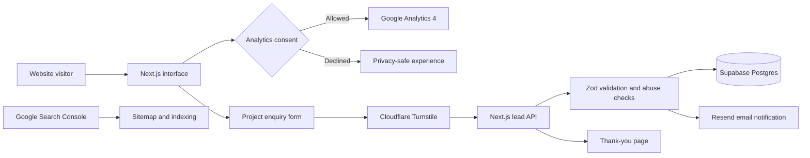

<div align="center">
  
  <h1>AashishLabs Studio</h1>
  <p><strong>Strategy · Design · Technology · Growth</strong></p>
  <p>
    A production-ready digital agency platform for startups, SMEs and MSMEs in India—built to communicate clearly, earn trust and convert interest into qualified enquiries.
  </p>
  <p>
    <a href="https://aashishlabs-studio.vercel.app"><strong>View live website</strong></a>
    ·
    <a href="https://aashishlabs-studio.vercel.app/services">Services</a>
    ·
    <a href="https://aashishlabs-studio.vercel.app/contact">Start a project</a>
  </p>

  
  
  
  
  
</div>

## About the project

AashishLabs Studio is more than a static agency landing page. It is a complete marketing and lead-acquisition system with responsive service pages, transparent concept work, editorial content, consent-aware analytics, protected enquiry handling and production deployment.

The platform currently presents four connected capabilities:

- Web design and development
- Apps and digital products
- Search engine optimisation
- Performance marketing

## Product highlights

- Premium, mobile-first agency experience with responsive navigation and action paths
- Reusable service, work and insight content architecture
- Qualified enquiry form with client and server-side validation
- Secure lead storage with attribution fields in Supabase
- Email notification workflow through Resend
- Cloudflare Turnstile bot protection, honeypot defence and request throttling
- Consent-aware GA4 tracking with advertising and personalisation disabled
- SEO metadata, structured data, sitemap, robots rules and Search Console verification
- Privacy policy, terms of use and a no-index thank-you journey
- Production deployment on Vercel with a Cloudflare-compatible OpenNext path

## How the system works



## Technology stack

| Area | Technology | Purpose |
| --- | --- | --- |
| Application | Next.js 16 App Router | Server rendering, static generation, metadata and API routes |
| Interface | React 19 + TypeScript | Typed, component-driven user experience |
| Styling | Tailwind CSS | Responsive layouts and the project design system |
| UI primitives | Radix UI | Accessible dialog, sheet, select, checkbox and accordion behaviour |
| Motion | Motion for React | Subtle reveal and interaction animation |
| Icons and typography | Lucide React + Poppins | Consistent visual language and branded wordmark rendering |
| Forms | React Hook Form | Performant form state and submission handling |
| Validation | Zod | Shared browser/server validation for lead payloads |
| Database | Supabase Postgres | Durable lead storage and campaign attribution data |
| Email | Resend | Immediate internal notification for new enquiries |
| Bot protection | Cloudflare Turnstile | Privacy-friendly challenge and server-side token verification |
| Analytics | Google Analytics 4 | Consent-aware traffic and conversion measurement |
| Search visibility | Google Search Console | Ownership verification, sitemap processing and indexing diagnostics |
| Hosting | Vercel | Production builds, environment configuration and global delivery |
| Testing | Vitest + Testing Library | Automated lead validation and normalisation checks |
| Code quality | ESLint + TypeScript | Static analysis and compile-time correctness |

## Third-party services

| Service | Production role | Why it is used |
| --- | --- | --- |
| **Vercel** | Hosting and deployment | Native Next.js deployment, preview builds, environment variables and edge delivery |
| **Supabase** | Lead database | Managed PostgreSQL with row-level security and a clean path to future CRM or CMS features |
| **Resend** | Lead notifications | Sends a structured email notification after a lead has been stored successfully |
| **Cloudflare Turnstile** | Spam protection | Stops automated form abuse without a traditional visual CAPTCHA |
| **Google Analytics 4** | Analytics | Measures traffic and successful enquiries only after the visitor’s analytics choice |
| **Google Search Console** | SEO operations | Confirms ownership, receives the sitemap and reports indexing/search issues |
| **WhatsApp** | Direct contact channel | Gives mobile visitors a lower-friction alternative to the full enquiry form |
| **GitHub** | Source control | Maintains version history and the production codebase |

The codebase also includes optional adapters for Microsoft Clarity, a future CRM webhook and deployment through OpenNext for Cloudflare. These are not required for the current Vercel production environment.

## Lead and privacy design

The enquiry workflow is intentionally server-controlled:

1. The browser validates required fields and collects campaign attribution.
2. Cloudflare Turnstile generates a token for the submission.
3. The Next.js API validates the payload and verifies the token server-side.
4. The lead is inserted into the protected Supabase `lead` table.
5. Resend notifies the AashishLabs inbox without blocking a successfully stored enquiry.
6. GA4 records `generate_lead` only through the consent-aware analytics layer.

Security and privacy measures include:

- Supabase row-level security with no public table access
- Server-only database and email credentials
- Turnstile server verification
- Honeypot and basic rate limiting
- Hashed IP address and user-agent values instead of raw storage
- GA4 Consent Mode with advertising storage and personalisation denied
- Security headers for content type, framing, referrers and browser permissions

## Routes

| Route | Purpose |
| --- | --- |
| `/` | Brand positioning, services, process, outcomes and primary conversion paths |
| `/services` | Overview of agency capabilities |
| `/services/[slug]` | Search-ready detail page for each service |
| `/work` | Transparently labelled concept builds |
| `/insights` | Editorial content and organic-search foundation |
| `/contact` | Protected project enquiry form and direct contact options |
| `/thank-you` | Conversion confirmation page excluded from search indexing |
| `/privacy-policy` | Analytics, lead-processing and privacy information |
| `/terms-of-use` | Website terms and service information |
| `/api/leads` | Validated, protected lead-ingestion endpoint |
| `/api/health` | Deployment health check |

## Local development

### Requirements

- Node.js 20.11 or newer
- pnpm 9 or newer

### Setup

```bash
git clone https://github.com/aashishlabs/AashishLabs-Studio.git
cd AashishLabs-Studio
pnpm install
```

Copy the environment template:

```bash
cp .env.example .env.local
```

On Windows PowerShell:

```powershell
Copy-Item .env.example .env.local
```

Start the development server:

```bash
pnpm dev
```

Open [http://localhost:3000](http://localhost:3000).

## Environment variables

Never commit real credentials. Values without the `NEXT_PUBLIC_` prefix must remain server-only.

| Variable | Visibility | Purpose |
| --- | --- | --- |
| `NEXT_PUBLIC_SITE_URL` | Public | Canonical website URL |
| `NEXT_PUBLIC_WHATSAPP_NUMBER` | Public | WhatsApp CTA destination |
| `NEXT_PUBLIC_SUPABASE_URL` | Public | Supabase project endpoint |
| `SUPABASE_SECRET_KEY` | Server only | Privileged server-side lead storage |
| `RESEND_API_KEY` | Server only | Resend authentication |
| `LEAD_NOTIFICATION_TO` | Server only | Internal lead-notification recipient |
| `NEXT_PUBLIC_TURNSTILE_SITE_KEY` | Public | Turnstile widget key |
| `TURNSTILE_SECRET_KEY` | Server only | Turnstile token verification |
| `NEXT_PUBLIC_GA_MEASUREMENT_ID` | Public | GA4 web stream identifier |

Optional integrations are documented in [`.env.example`](.env.example).

## Quality checks

```bash
pnpm lint
pnpm typecheck
pnpm test
pnpm build
```

The current production release passes linting, TypeScript validation, automated tests and the optimized Next.js build.

## Content architecture

Public service, work, insight and brand content lives in [`content/site.ts`](content/site.ts). Components access it through [`lib/content/repository.ts`](lib/content/repository.ts), creating a clean boundary for a future Supabase-powered CMS without rebuilding the page layer.

Supporting documentation:

- [Analytics event map](docs/analytics-event-map.md)
- [Content editing guide](docs/content-editing-guide.md)
- [Deployment runbook](docs/deployment-runbook.md)
- [Supabase lead migration](supabase/migrations/0001_leads.sql)

## Deployment

The public website is deployed on Vercel:

**[https://aashishlabs-studio.vercel.app](https://aashishlabs-studio.vercel.app)**

The repository also includes OpenNext and Wrangler configuration for a future Cloudflare deployment path.

## Roadmap

- Add verified client work, testimonials and measurable outcomes
- Move public content to a lightweight CMS when editorial volume grows
- Connect a custom domain and verified Resend sending domain
- Add a CRM workflow when enquiry volume requires pipeline automation
- Expand organic-search content around startup, SME and MSME needs in India

## Contact

For project enquiries, visit the [AashishLabs contact page](https://aashishlabs-studio.vercel.app/contact) or email [aashishlabs@gmail.com](mailto:aashishlabs@gmail.com).

---

<div align="center">
  Built by <strong>AashishLabs</strong> — digital experiences designed to earn trust, drive action and support growth.
</div>
